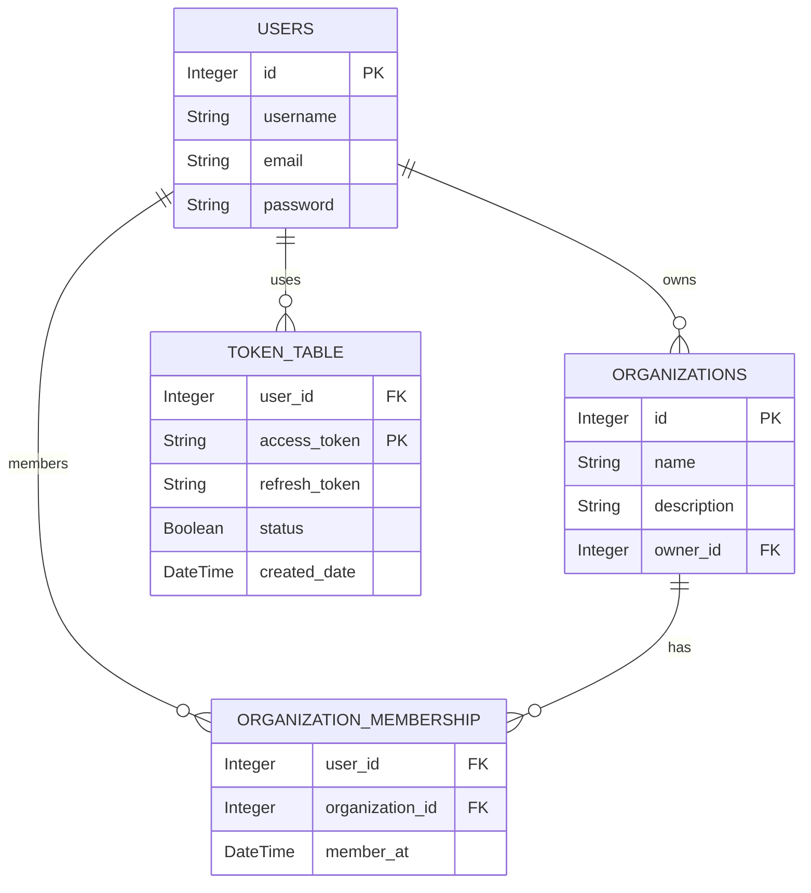

# 🌐 Organization Management System

## 📚 Table of Contents

- [Introduction](#introduction)
- [Prerequisites](#prerequisites)
- [Installation](#installation)
- [Usage](#usage)
- [API Endpoints](#api-endpoints)
- [Database Schema](#database-schema)
- [License](#license)

## 🚀 Introduction

The **Organization Management System** is an API built with **FastAPI** and **SQLAlchemy** that allows users to manage organizations, user memberships, and handle authentication with JWT tokens. This system provides a structured way to create and manage organizations, invite users, and maintain a database of users and their associations.

## 🛠️ Prerequisites

To use this project, ensure you have the following installed:

- Python 3.7 or higher 🐍
- pip (Python package installer) 📦
- Git 🧑‍💻

## 🏗️ Installation

### Clone the Repository

Clone the project repository to your local machine:

```bash
git clone <repository-url>
cd <repository-directory>
```

Replace `<repository-url>` with the actual URL of the repository and `<repository-directory>` with the name of the cloned directory.

### Set Up a Virtual Environment

Create and activate a virtual environment:

```bash
python -m venv env
source env/bin/activate  # On Windows use `env\Scripts\activate`
```

### Install Dependencies

Install the necessary dependencies:

```bash
pip install -r requirements.txt
```

## ⚙️ Usage

To run the FastAPI application, execute:

```bash
uvicorn app.main:app --reload
```

You can access the application at `http://localhost:8000` 🌐.

## 📡 API Endpoints

The following API endpoints are available:

- **GET** `/organization/`: Retrieve all organizations 📋.
- **POST** `/organization/`: Create a new organization ➕.
- **GET** `/organization/{organization_id}`: Retrieve details of a specific organization 🔍.
- **PUT** `/organization/{organization_id}`: Update details of a specific organization ✏️.
- **DELETE** `/organization/{organization_id}`: Delete an organization ❌.
- **POST** `/organization/{org_id}/invite`: Invite a user to join an organization 📧.

## 🗃️ Database Schema

The application uses SQLAlchemy for database interactions. Below is an overview of the database schema:

### Users Table

- **id**: Integer (Primary Key) 🔑
- **username**: String 🧑
- **email**: String (Unique) 📧
- **password**: String 🔒

### Organizations Table

- **id**: Integer (Primary Key) 🔑
- **name**: String 🏢
- **description**: String 📜
- **owner_id**: Integer (Foreign Key) 👤

### Token Table

- **user_id**: Integer (Foreign Key) 🔑
- **access_token**: String (Primary Key) 🗝️
- **refresh_token**: String 🔄
- **status**: Boolean ✅
- **created_date**: DateTime 📅

### Organization Membership Table

- **user_id**: Integer (Foreign Key) 🔑
- **organization_id**: Integer (Foreign Key) 🔑
- **member_at**: DateTime ⏰

### 🖼️ Database Schema Diagram



## 📝 License

This project is licensed under the MIT License - see the [LICENSE](LICENSE) file for details 📄.

---
